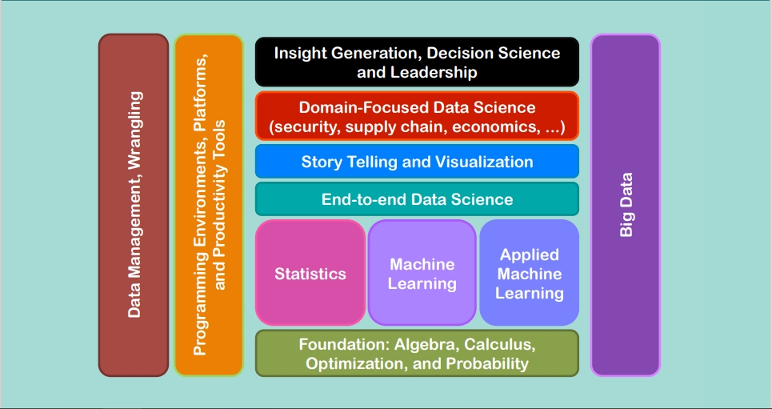
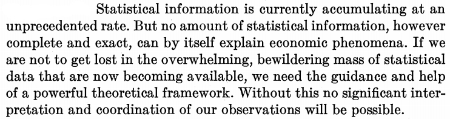

```{r, load_refs, include=FALSE, cache=FALSE}
library(RefManageR)
library(tidyverse)
BibOptions(check.entries = FALSE,
           bib.style = "authoryear",
           style = "markdown",
           hyperlink = FALSE,
           dashed = TRUE)
#biblio <- ReadBib("../../References/References.bib", check = FALSE)
```

# What is Data Science?

- .hi[Data science (DS):] The scientific discipline that deals with transforming data into useful information ("insights") using a variety of stats/ML techniques

    - Amazon: Collects data on search history, cart history, purchases

    - Analyzes the data to estimate users' willingness to pay for various products (including Prime); recommend new products

- The rise of data science has come because of the so-called Big Data revolution

    - The rise of the internet in the late-1990s and 2000s $\Rightarrow \,\uparrow$opportunities for companies and governments to collect data on consumers & citizens

    - Proliferation of mobile devices & social media from late 2000s until now has generated even more data
    


---

# Skills required for data science

.center[
```{r img1, echo=F, out.width="75%"}

```

Source: [NC State Univ.](http://sites.nationalacademies.org/cs/groups/cstbsite/documents/webpage/cstb_181680.pdf) (p. 26)
]


---
# Pillars of data science

- Programming (for automation of data collection, manipulation, cleaning, visualization, and modeling)

- Visualization & exploration

- Machine learning (to select models, compress data)

- Causal inference (to be able to make a policy prescription)

...Assuming one has the appropriate foundation of basic calculus and statistics


---
# The data science workflow

.center[
```{r img2, echo=F, out.width="85%"}
knitr::include_graphics('https://d33wubrfki0l68.cloudfront.net/571b056757d68e6df81a3e3853f54d3c76ad6efc/32d37/diagrams/data-science.png')
```

Source: [R for Data Science](http://r4ds.had.co.nz/introduction.html)
]


---
# Big Data


.center[
```{r img3, echo=F, out.width="90%"}

```
]


---
# Big Data


.center[
```{r img, echo=F, out.width="90%"}

```
]

Source: Frisch, Ragnar. 1933. "Editor's Note" _Econometrica_ 1(1): 1--4


---
# What is Big Data?

It depends on who you ask. It could mean:

1. "Wild" data (unstructured; collected without a particular intention; e.g. twitter, contrast with Census surveys)

2. "Wide" data (a.k.a. "Big-K" data because $K>N$)

3. "Long" data (a.k.a. "Big-N" data because $N$ very, very large [and may not all fit onto a single hard drive!])

4. Any data set that cannot be analyzed with classical methods like OLS (e.g. all combinations of the above three types)

"Big Data" not so much about size of data, but about whether or not "small data" (read: classical) methods can be used


---
# What is machine learning? What is AI?

- .hi[Machine learning (ML):] Allowing computers to learn for themselves without explicitly being programmed

    - USPS: Computer to read handwriting on envelopes

    - Google: AlphaGo, computer that defeated world champion Go player

    - Apple/Amazon/Microsoft: Siri, Alexa, Cortana voice assistants 

- .hi[Artificial intelligence (AI):] Constructing machines (robots, computers) to think and act like human beings

- ML is a subset of AI


---
# Big data & machine learning

- You'll often hear the phrase "big data and machine learning"

- This is because many machine learning algorithms are helpful for big data problems:

    - Selecting which $k<K$ covariates should enter your model

    - Streamlined techniques for processing "wild" data

    - New modeling approaches that can leverage the greater amount of information that Big Data has


---
# Correlation vs. causation

- Machine learning is not the end-all, be-all of data science

- A good data scientist knows that correlation is not causation!

- Ultimately companies want "insights" that they can use to $\uparrow$profits

- Tech co.'s run randomized experiments to estimate causal effects

- Can also estimate fancier statistical models to account for selection

- Economists' comparative advantage is in combining machine learning with economic theory to produce optimal policies


---
# Example

> One very classic example comes from looking at the data of a shopping cart. Why do sales of beer and diapers go hand in hand? The correlation is women tell their husbands to go pick up diapers, and on the way, they pick up beer, too. That is data science: finding trends from your data and using that insight to increase your sales or market better

Source: http://www.chicagotribune.com/bluesky/originals/ct-bsi-inside-job-4c-insights-20171002-story,amp.html


---
# Lifestyle

- What's it like to have a DS job right now: https://www.simplilearn.com/a-day-in-the-life-of-a-data-scientist-article

- Data scientist job profiles: https://www.mygreatlearning.com/blog/different-data-science-jobs-roles-industry/


---
# Final project

- A large portion of your grade will come from a final project

- You should find a research question you're interested in and some data you can use to answer it

- If you are short on ideas, check out https://www.kaggle.com/datasets which routinely hosts analytics competitions

- Kaggle publishes data for each competition

- Main criterion for the project is to apply skills developed in this class

- If you have more questions, please come see me
